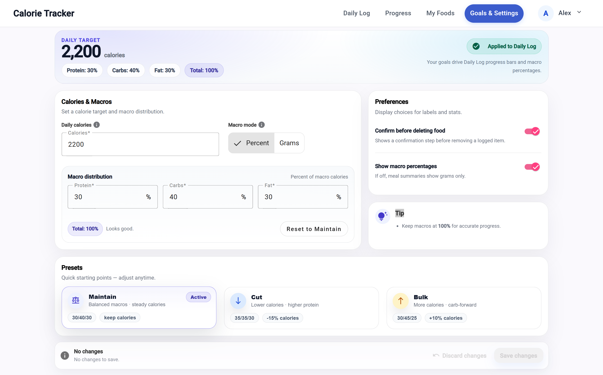

# Calorie Tracker  
Angular 21 + ASP.NET Core (.NET 10)

A full-stack calorie tracking web application built with Angular 21 and ASP.NET Core (.NET 10), focused on clean architecture, maintainability, and thoughtful UI/UX design.

The application supports daily meal logging, flexible unit-based nutrition tracking, and progress insights over time.

It is intentionally desktop-first, production-minded, and structured around real-world application constraints.

---

## 📸 Screenshots

### Daily Log
Log meals, track calories and macros, and see a clear daily breakdown at a glance.


---

### Add Food
Search foods, adjust quantities and units, and add multiple items in a single flow.


---

### Progress
Visualize 7-day calorie trends, daily targets, and consistency over time.


---

### Goals & Settings
Configure calorie targets, macro distribution, presets, and display preferences.



---

### My Foods
Manage a personal food library with custom foods, reusable units, and safe archiving.


---

## 🚀 Tech Stack

### Frontend
- Angular 21
  - Stand-alone components (no NgModules)
  - Signals for reactive state
  - Angular Material (custom theming)
  - Reactive Forms
- TypeScript
- CSS

### Backend
- ASP.NET Core (.NET 10)
- Entity Framework Core
- RESTful API
- JWT authentication
- Clean separation of concerns (Controllers → Services → Domain models → DTOs)

### Data
- SQL Server LocalDB / SQLite (development)
- Code-first EF Core migrations
- Seeded sample food data

---

## ✨ Features

- Daily meal logging with calorie and macro tracking
- Add foods with dynamic units (g, oz, servings, pieces)
- Server-side nutrition aggregation
- Custom food management
- 7-day progress insights
- Responsive, desktop-focused UI
- Authentication and protected routes

---

## 🧠 Architecture Highlights

- Angular **stand-alone components** aligned with Angular 21 best practices
- Backend layered architecture:
  - Controllers
  - Application services
  - Domain entities
  - DTOs and mappers
- Nutrition calculations handled **server-side**
- Flexible unit conversion model (`FoodUnit` with conversion factors)
- Explicit DTO boundaries (EF entities never exposed to the client)

The codebase is designed to be **readable, reviewable, and maintainable**.

---

## 🧩 Design Decisions

The following decisions were made intentionally to balance maintainability, scalability, and developer experience.

### Why Angular Stand-Alone Components
The frontend uses Angular stand-alone components instead of NgModules to align with current Angular recommendations.

Benefits:
- Reduced boilerplate and simpler dependency management
- Clearer component boundaries
- Easier code navigation and onboarding

---

### Why Server-Side Nutrition Calculations
All calorie and macro calculations are performed on the backend.

Reasons:
- Ensures a single source of truth
- Prevents duplication of business logic across clients
- Allows future expansion (mobile apps, integrations) without re-implementing calculations
- Simplifies the frontend and keeps it focused on UI concerns

---

### Unit Conversion Model
Foods are stored using a base quantity and base unit (e.g. 100g), with additional units defined via conversion factors.

This approach:
- Avoids storing redundant nutrition data per unit
- Supports flexible serving sizes (grams, ounces, pieces, servings)
- Keeps nutrition calculations predictable and extensible

---

### Explicit DTO Boundaries
Entity Framework Core entities are never exposed directly to the client.

Instead:
- Controllers return DTOs
- Mapping is handled explicitly
- Domain models remain decoupled from API contracts

This reduces accidental coupling and mirrors patterns used in production APIs.

---

### Desktop-First UI Strategy
The UI is designed primarily for desktop usage rather than mobile-first.

Rationale:
- This application targets users entering and reviewing data in longer sessions
- Desktop layouts allow denser information display without sacrificing clarity
- Responsiveness is still supported, but desktop is the primary design constraint

---

### Limited Public Scope
This repository intentionally contains a **focused subset** of the overall application.

Excluded areas include:
- Monetization and subscription logic
- Advanced insights and recommendation engines
- Large-scale food import pipelines
- Administrative and moderation tooling

---

## 🛠 Running the Project Locally

### Prerequisites
- Node.js (LTS)
- Angular CLI
- .NET 10 SDK
- SQL Server LocalDB or SQLite

---

### Backend
```bash
cd API
dotnet restore
dotnet ef database update
dotnet run
